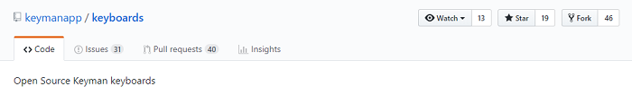

## Install Keyman Developer

While Keyman Developer is not absolutely necessary to build or submit keyboard layouts,
the program has many features that will make keyboard development much simpler.

Keyman Developer has a powerful Project feature that makes it easier to manage the keyboard project.
Each keyboard in the repository will have an associated **Keyman Project .kpj file**
that can be built from within Keyman Developer.
This project file is the starting point for any work you do on a keyboard.

Make sure you have Keyman Developer 13.0 or later.
You can download Keyman Developer from [https://keyman.com/developer](https://keyman.com/developer).

## Building keyboards with Keyman Developer

Double-click a `.kpj` file in Explorer to open the project in the Keyman Developer Integrated Development Environment (IDE).
You can also open a project from the Project menu within the IDE.
The project is automatically updated when you make changes,
and changes specific to your computer are saved in a `.kpj.user` file along with the `.kpj` file.
This `.kpj.user` file can be deleted at any time, and should not be included when you submit your keyboard.

In the Project screen, in either the Keyboards or the Packages tab,
you can click "Build all" to build all the keyboard and package files listed in the project.
(If the project has dependencies on other projects, you will need to build them first.
Currently Keyman Developer does not resolve project dependencies.)

## Determine the local folder which will hold your keyboards

Although you can choose another folder, Keyman Developer defaults to using the folder **Keyman Developer** in the user's **Documents** folder.

This guide will use the sample keyboard name **sample1** located in the **s** folder (based on the first letter of "sample1"):

```
C:\Users\USERNAME\Documents\Keyman Developer\Projects\s\sample1
```

## Create a GitHub account

The Keyman repositories are stored on GitHub.
If you don't already have one,
you will need to [create](https://github.com/join) a GitHub account using your web browser.

## Fork the Keyboards repository

From a web browser, log into GitHub and fork the Keyman **keyboards** repository
by visiting [https://github.com/keymanapp/keyboards](https://github.com/keymanapp/keyboards)
and clicking the **Fork** button on the top-right to create your own fork.



Now let's take a closer look at the files in the keyboard project.

[Step 2: Organizing the Keyboard Files](step-2 "Step 2: Organizing the Keyboard Files")
