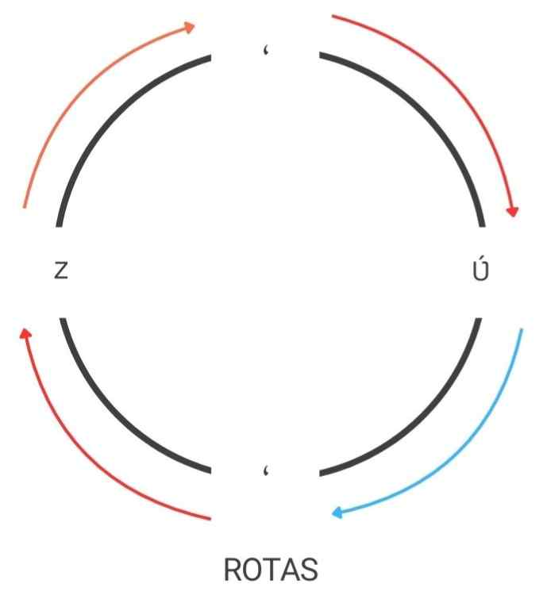

Rotational keys, or "rotas" are combinations of one or more keys pressed together to produce a character or letter output, following the sequences defined by Keyman rules, and they will always end up back to the first letter as part of a rotation.

To easily understand this, check and test the rules:
```keyman
begin Unicode > use(main)
group(main) using keys

'c' + 'c' > 'č'             c caron
'č' + 'c' > 'cc'              c double c
'cc' + 'c' > 'čč'              c double c caron
'čč' + 'c' > 'c'              c back to c
```

The rules below allows the combination of <kbd>z</kbd> with one of the diacritics (\`,',~) to output v with hook and an accent (ʋ̀, ʋ́, ʋ̃). If the next key is one of the `store(diacritic_key)`, then it will produce <kbd>z</kbd>.



```keyman
begin Unicode > use(main)
group(main) using keys

store(lat_norm_replacement) "zxc;ZXC:"
store(lat_vowel) "ʋɛɔɩƲƐƆɭ"
store(diacritic_key) "`'~"
store(diacritic) U+0300 U+0301 U+0303

any(lat_norm_replacement) + any(diacritic_key)> index(lat_vowel, 1) index(diacritic, 2) dk(one)  c z + ' > ʋ́

any(diacritic_key) dk(one) > index(lat_norm_replacement, 1) c ʋ́ + ' > z
```

## See also
* [store()](../reference/store)
* [any()](../reference/any)
* [index()](../reference/index)
* [Xinaliq Keyboard Help](/keyboard/xinaliq/1.1.4/xinaliq#toc-how-to-use-this-keyboard)