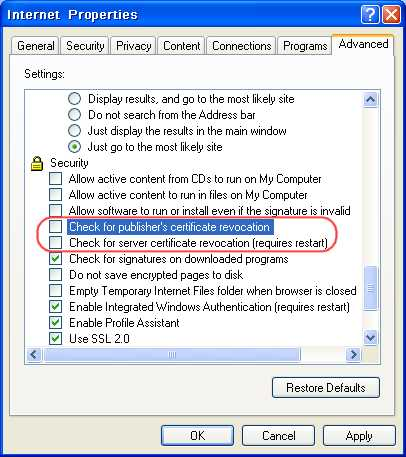

# Keyman starts very slowly (especially on Windows Server 2003)

### **NOTE**: This archived documentation has not been updated recently and may contain information that is no longer relevant

## Explanation

To ensure that Keyman and Keyman Developer have not become corrupted, an integrity check is executed
each time either application is started.  Part of this check involves verifying a digital signature,
or certificate, using the standard Internet certificate validation process. Certain certificate checking
options require an on-line test of certificate validity with a certificate authority, which requires
an open internet connection and makes starting take a long time.  This option is enabled by default
on Windows Server 2003, and may be enabled in some situations with other versions of Windows.

## Solution

Recommended solution: Upgrade to version 6.2.171.0 or later.

**Note:** This behaviour has changed since 6.2.171.0.  Keyman and Keyman Developer no longer verify
certificate revocation, so this behaviour no longer occurs.

Alternative solution: Go to **Control Panel->Internet Properties->Advanced** and disable "Check for
publisher's certificate revocation" and "Check for server certificate revocation" by clearing the two
check boxes indicated in the following image.

## Applies to:
* Keyman 6.0
