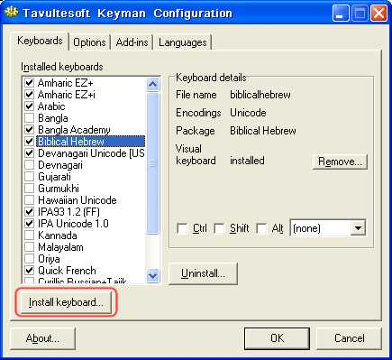

# HOWTO: Resolve keyboard installation issues on Windows Server 2003

### **NOTE**: This archived documentation has not been updated recently and may contain information that is no longer relevant

Older versions (6.0.164.0 and earlier) of Tavultesoft Keyman fail to install keyboards by association
(i.e. by clicking on the keyboard file name) on Windows Server 2003.

<h2>SOLUTION</h2>

Upgrade to the latest release of Keyman

Keyboards may still be installed by right-clicking on Keyman icon (in the taskbar's
icon tray), selecting Keyman Configuration, then using the Install keyboard button, as shown in the image
below.  

## Applies to:
 * Keyman 5.0
 * Keyman 6.0
