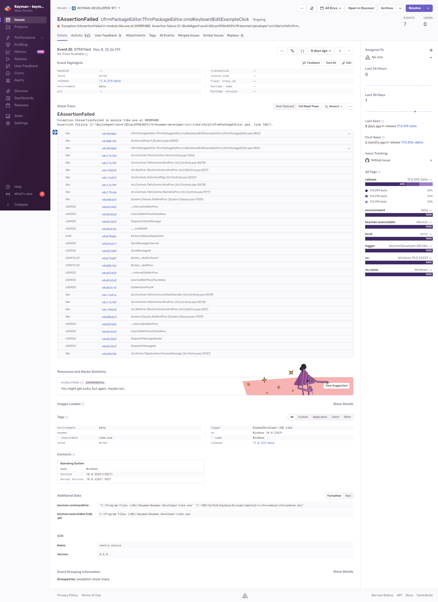

# My antivirus or security software reports Keyman is a potential key logger, trojan or spyware

**Most importantly, Keyman is not a trojan, key logger, or spyware.**

**Keyman do not and will never engage in deceptive software practices, such as
spyware, malware, viruses or trojans.**

Keyman uses advanced technology to remap your keyboard by trapping keystrokes as
they are typed.  Unfortunately, some spyware applications use the same basic
method of trapping keystrokes as Keyman.  Understandably, some security software
companies have decided to warn their users when they are using a program that
traps keystrokes.  This then means that Keyman is falsely identified as spyware
by some security software.

We are working with antivirus and security software companies to remedy this.
If you come across this situation, please reach out to us at [SIL Keyman
Community](https://community.software.sil.org/c/keyman/19), with details of the
antivirus or security program that is causing the problem, and we will contact
the developer of that software in order to come to a resolution.

You may also add Keyman to your security software whitelist.

The full source code of Keyman can be audited at
https://github.com/keymanapp/keyman.

Keyman never transmits any data about what you type from your computer.  These
are modules in Keyman that include Internet connectivity:

  - **Automatic Software Updates:** Periodically, Keyman checks online at our
    website for an updated version.  Keyman does not send any personally
    identifiable details in this process. Keyman sends only the following
    details to the website:
    - The application name - e.g. Keyman or Keyman Developer
    - The current version you are running
    - The set of installed keyboard identifiers and their versions

    If you would prefer not to have Keyman check for updates automatically, you
    can turn off automatic updates in the Options tab of Keyman Configuration.

  - **Crash Reports:** If Keyman encounters an error condition, then it may send
    a crash report to our error management service, keyman.sentry.io. These
    reports include technical details of the error, and details on the version
    of the operating system and the file that caused the problem.

    These reports do not contain user data, apart from sometimes including a
    file path (e.g. `C:\Users\...`).

    Crash reporting can be switched off at installation time, in the Setup
    Options dialog, or in Keyman Configuration. It is switched on by default.

    A sample report is shown below:

    

  - **Anonymous usage statistics:** Keyman for Windows as of version 17 does not
    collect anonymous usage statistics, even though there is an option in Keyman
    Configuration to disable this. Collection of anonymous statistics on which
    functionality in Keyman is in use is on the Keyman roadmap. The information
    that is planned to be collected would be: the modules that are accessed,
    e.g. which tabs of Keyman Configuration are opened, and which options are
    turned on or off. This data would be anonymous and aggregated.

  - **Diagnostics:** Keyman Configuration includes a diagnostic tool that you
    can use in order to track down conflicts if they occur.  The diagnostic tool
  collects a number of details about your computer, and presents them on-screen.
  You can then choose to send these details to Keyman team for further
  assistance.  The details of the report include the basic hardware
  configuration of your computer, the current configuration of Keyman, a list of
  currently running applications, a list of applications that are configured to
  start with Windows, and details about which languages you have installed in
  Windows.  This system information report will never be sent to us without your
  express approval. Keyman will keep this system information report confidential
  and will destroy it upon request.

Please also see our [Privacy Policy](https://keyman.com/privacy) for further
information.

## Applies to:
* Keyman for Windows 14.0+
* Keyman Desktop 5.0 - 13.0
