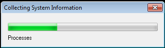
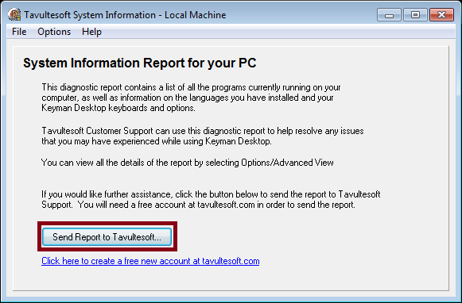
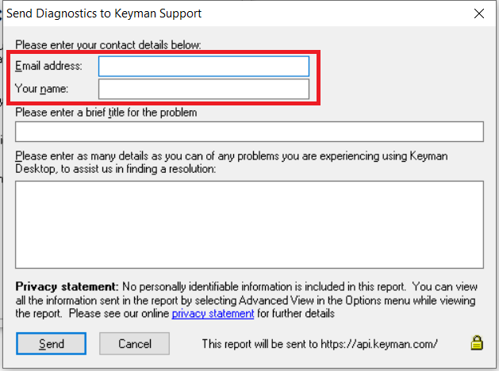
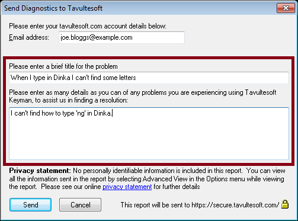
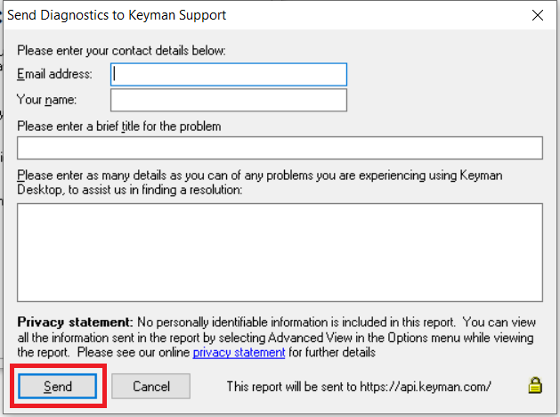

# HOWTO: Send a diagnostic report to Keyman Support

Keyman Support may ask you to send a support diagnostic. These reports assist us in resolving your support issues. Please follow the steps below to generate a diagnostic report.

<b>Note:</b> If Keyman is not currently installed on your computer, you can download the diagnostic tool as a standalone here: 
<a href='https://downloads.keyman.com/tools/tsysinfo/tsysinfo.exe'>tsysinfo.exe</a> (5MB)

<ol>
<li>
  <b>Open Keyman Configuration.</b> 
  

    <ol type="1">
      <li>
Click on the Keyman Desktop icon , on the Windows Taskbar near the clock.
</li>
      <li>
From the Keyman Desktop menu, select Configuration….
</li>
    </ol>

</li> 

<li>
  <b>Select the Support tab.</b> 
  

</li> 

<li>
  
You can collect diagnostic information about Keyman by clicking the 'Diagnostics' link under the 'Useful Links' section. The support diagnostic will collect critical diagnostic information from your computer and generate a report.

</li> 

<li>
  <b>Wait while your diagnostic data is collected.</b> 
  

</li> 

<li>
  <b>Click</b> <button type='button'>Send Report to Keyman Support…</button>. 
  

</li> 

<li>
  <b>Fill in your email address and your name.</b> 
  

</li> 

<li>
  <b>Fill in details about the problem you are experiencing. Include as much information
     as you can, especially any error messages you have received - word for word - and the
     language and/or keyboards you are working with.</b> 
  

</li> 

<li>
  <b>Click</b> <button type='button'>Send</button>. 
  

</li> 

<li>
  <b>When we receive your diagnostic report, we will review it and reply, working with you to help you find a solution to your issue.</b>
</li>

</ol>

## Applies to:
 * Keyman Desktop 8.0 and above
