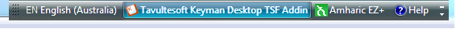
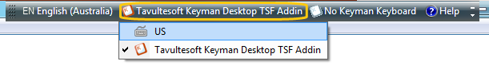
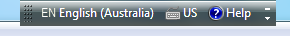
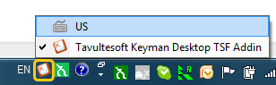

# HOWTO: Turn the Keyman Text Services Framework Addin on or off

### **NOTE**: This archived documentation has not been updated recently and may contain information that is no longer relevant

The Keyman Text Services Framework Addin is not useful in all applications.  To turn the Addin off, you can follow the procedure below.  
The Language Bar can be either floating at the top of your screen, or docked in the Taskbar.

## Steps when the Language Bar is Floating

1. Locate the Language Bar.  It is floating at the top of your screen.  See the picture below for an example of what the Language Bar looks like.

2. Click on the Keyman button on the Language Bar, and select an alternative keyboard layout (in the picture, the alternative layout is US):

3. When the Keyman Text Services Framework Addin is off, the Language Bar should look similar to the picture below:

## Steps when the Language Bar docked in Taskbar

1. Locate the Language Bar.  It is located on your Taskbar.  See the picture below for an example of what the Language Bar looks like.

2. Click on the Keyman button on the Language Bar, and select an alternative keyboard layout (in the picture, the alternative layout is US):

3. When the Keyman Text Services Framework Addin is off, the Language Bar should look similar to the picture below:

## Alternate Procedure Using a Hotkey

You can also switch the Addin on and off by pressing Left Ctrl+Shift (this hotkey can be configured by right-clicking on the Language Bar and selecting Settings).

## Notes on installing the Text Services Framework Addin

- The Text Services Framework Addin is only available in Keyman Desktop Professional
- If the Text Services Framework Addin is not installed, you must install it first through the Keyman Desktop Professional installer.  You can check the installation status of the Addin in Keyman Dersktop Configuration, in the Addins Tab - it will be listed under "kmtip". 
- If the Text Services Framework Addin is not available for a language you have installed, you can configure the Addin to be available for all installed languages by starting Keyman Desktop Configuration, selecting the Addins tab, and clicking Configure
- See [KMKB0052](/kb/?id=52) for instructions on how to remove the Text Services Framework Addin

## Applies to:
 * Keyman Desktop Professional 7.0