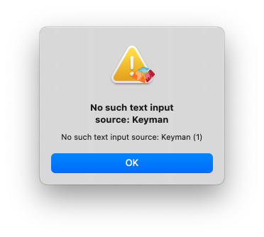

# HOWTO: Fix error message "No such text input source: Keyman" on macOS

If you encounter the error message "No such text input source: Keyman" when attempting to install Keyman on macOS, as illustrated below,
your macOS installation may have a corrupt keyboard settings cache.



## Resolve the issue with a Safe Boot

1. Try a [Safe Boot](https://support.apple.com/kb/PH25617). This often resolves the problem. If this does not work, continue on with the next section.

## Manually resolve the issue

These steps remove certain system files that your Mac will automatically replace when needed.

1. Open Terminal.app, which is in the Utilities folder of your Applications folder.

2. Copy and paste the following command into the Terminal, then press Return:

    ```
    sudo rm /System/Library/Caches/com.apple.IntlDataCache*
    ```

3. Type your administrator password when prompted, then press Return.

4. Copy and paste the following command into the Terminal, then press Return:

    ```
    sudo rm /var/folders/*/*/*/com.apple.IntlDataCache*
    ```

5. You may need to restart your Mac to complete the fix.

---

These instructions were part of an [Apple Support article](https://web.archive.org/web/20200113010318/https://support.apple.com/en-us/HT203221) which has since been retired. The link given here is to an archived version of the article.

* Keyman Issue Reference: [#5578](https://github.com/keymanapp/keyman/issues/5578)
