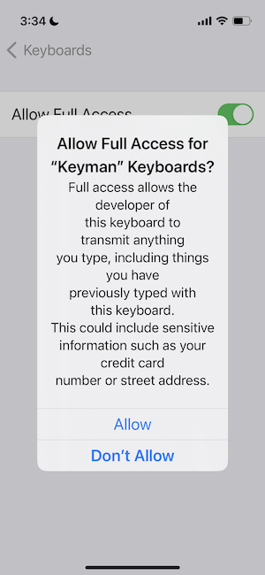

# HOWTO: Fix blank keyboard on iOS 16

After upgrading to iOS 16, the Keyman keyboard may appear completely blank:

To make Keyman visible again, you must change your setting on your iPhone or iPad to Allow Full Access to Keyman. 

## How to Allow Full Access to Keyman

1. Tap on Settings and go to General > Keyboard > Keyboards > Keyman

2. Tap the Allow Full Access switch to move it to the on position.

3. When you see the alert, as shown below, tap Allow.

After making this change, the Keyman keyboard will be visible and function properly. No restart of the device should be necessary.