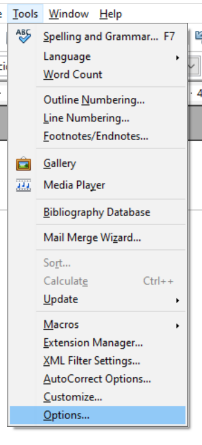
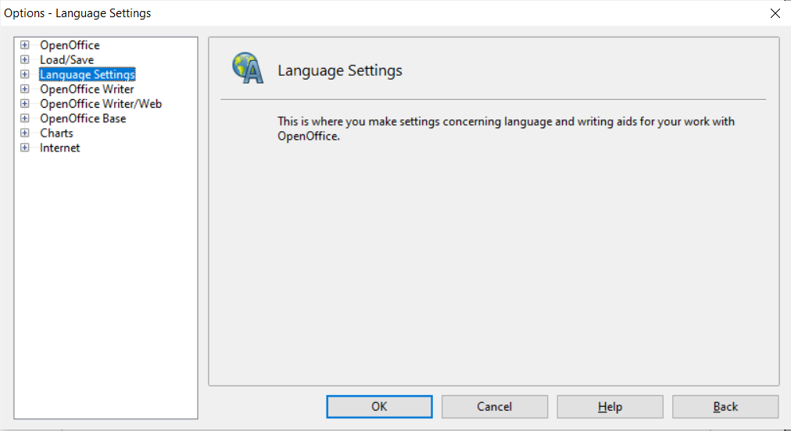
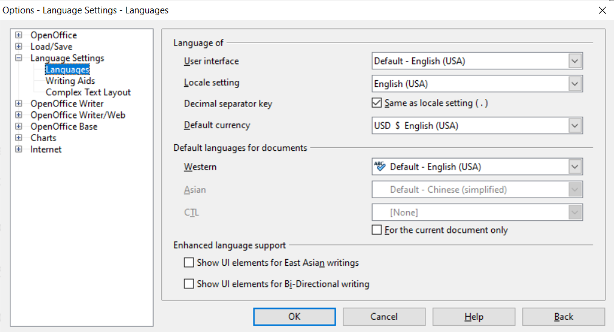
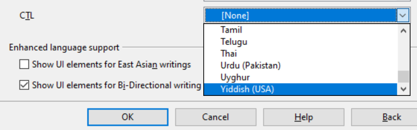
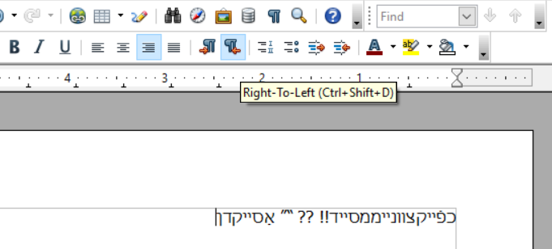

# HOWTO: Configure third-party application for right-to-left languages on Windows

### **NOTE**: This archived documentation is valid for the latest version of applications as of February 22, 2024.

Now, most of the applications fully support right-to-left typing styles without any configuration. 
If any third-party application seems to not fully recognize right-to-left typing style when typing, especially for Keyman keyboards, please follow these steps:

### OpenOffice Writer
1. Select **Tools** in the menu bar of the application.

2. Choose **Options...** from the drop-down.

3. Once the Options window appears, go to **Language Settings**.

4. Then select **Languages**, and these options will show up.

5. Make sure to *"tick"* **Show UI elements for Bi-directional writing**.  
You can select the language for the **CTL** (optional), then click OK.

6. Now, the options should appear for toggling between left and right typing styles. Enjoy!

### Mozilla Thundrbird
Some applications like Thunderbird requires an add-on to get right-to-left typing styles to work properly. See here [Right-to-left languages support in Thunderbird](https://connect.mozilla.org/t5/ideas/right-to-left-languages-support-in-thunderbird/idi-p/34300).

### Keyman configuration for Windows
If any application encounters this issue only on one machine, here is an example of how to get it done with [Keyman configuration](https://community.software.sil.org/t/rtl-switches-to-ltr-with-punctuation/8061/14).

## See also
* [KMKB0041 - Configure Windows for right-to-left languages such as Arabic, Farsi or Hebrew](/kb/41)

## Applies to:
* Keyman for Windows 
* Apache OpenOffice 4.1.15
* Mozilla Thundrbird 115.7.0