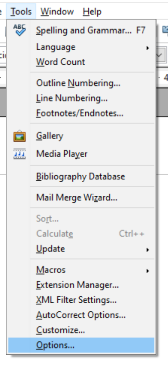
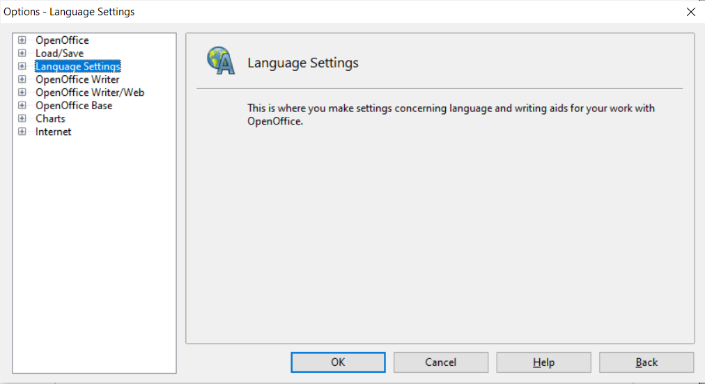
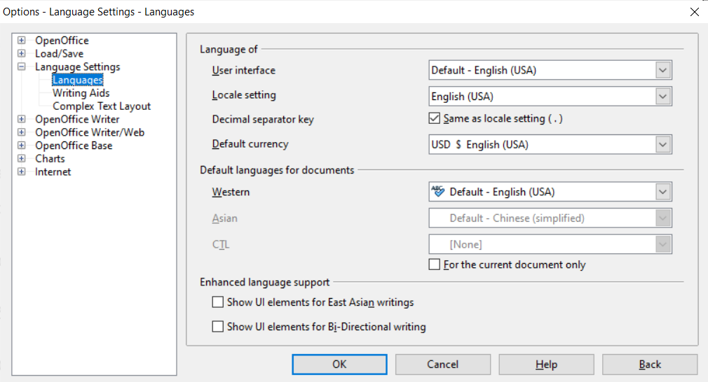
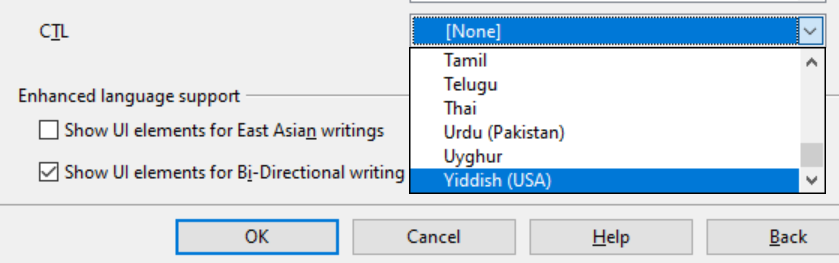
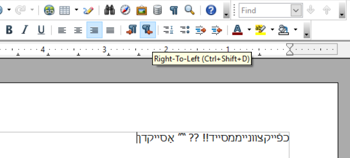
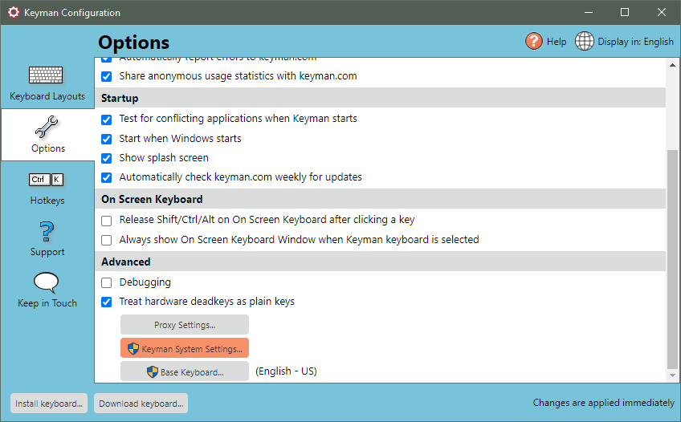
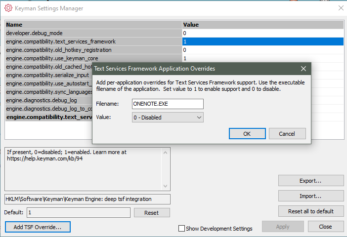

# HOWTO: Configure third-party application for right-to-left languages on Windows

Now, most of the applications fully support right-to-left typing styles without any configuration. 
If any third-party application seems to not fully recognize right-to-left typing style when typing, especially for Keyman keyboards, please follow these steps:

### OpenOffice Writer
1. Select **Tools** in the menu bar of the application.

2. Choose **Options...** from the drop-down.

3. Once the Options window appears, go to **Language Settings**.

4. Then select **Languages**, and these options will show up.

5. Make sure to *"tick"* **Show UI elements for Bi-directional writing**.  
You can select the language for the **CTL** (optional), then click OK.

6. Now, the options should appear for toggling between left and right typing styles. Enjoy!

### Mozilla Thundrbird
Some applications like Thunderbird requires an add-on to get right-to-left typing styles to work properly. See here [Right-to-left languages support in Thunderbird](https://connect.mozilla.org/t5/ideas/right-to-left-languages-support-in-thunderbird/idi-p/34300).

### Keyman configuration for Windows
If one application is not working correctly you can disable Keyman use of the
Text Services Framework(TSF) API for just that application it may resolve the
issue. This is an advanced setting. 

A known example is OneNote. The text output is correct, however when entering
punctuation the cursor jumps to the incorrect side of the punctuation but is
corrected on the next keystroke. This can be unsettling to the user when typing.
Disabling the TSF resolves this behavior

To do this open Keyman Configuration and Choose the Options tab on the left,
then scroll down to the bottom and select the Keyman System Settings... button.

 

In the window that appears now select(click once) the row that says
engine.compatibility.text_services_framework. Then select the button on the
bottom left Add TSF Override.... Type ONENOTE.EXE (or the name of the
application) in the Filename: field and select 0 - Disabled in the Value: field.
Select OK and then Apply.

Restart Keyman and OneNote

## See also
* [KMKB0041 - Configure Windows for right-to-left languages such as Arabic, Farsi or Hebrew](/kb/41)

## Applies to:
* Keyman for Windows 
* Apache OpenOffice 4.1.15
* Mozilla Thundrbird 115.7.0
