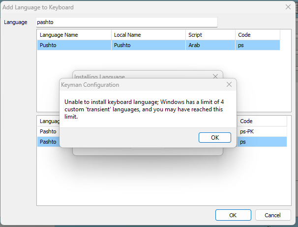

# HOWTO: Working with transient languages on Keyman for Windows

This article will help solve the error of the limitation of 4 custom language tags for Keyman.


## Background - Windows

Windows has a set of ‘supported’ languages, which each have their own code identifier, but that covers only a tiny fraction of the languages listed in the BCP47 standard. For all the remaining languages, Windows has allocated 4 transient LCIDs (Language Code Identifiers) **(*0x2000*, *0x2400*, *0x2800*, *0x2C00*)**. These identifiers are really only used for legacy applications, but their use is embedded so deeply in Windows, particularly in terms of input methods, that it is impossible to add more than 4 languages that are not directly supported.

## Background - Keyman

With Keyman, we register each keyboard against each of those identifiers when we install it (in the local machine context). Then, the current user context can be used to select the languages that the user wishes to use.

## Find out your language information

This is helpful to see what is being listed as transient language on your system.

What to look out for when running the command is the **TransientLangId** that uses the format of `0x2000`, `0x2400`, `0x2800`, and `0x2C00`.

```c
TransientLangId    REG_DWORD    0x2400
```

### Input

By using this command in the Command Prompt, you will see the allocated transient language code identifiers.
```c
reg query "HKCU\Control Panel\International\User Profile" /
``` 

### Output

```c
HKEY_CURRENT_USER\Control Panel\International\User Profile\und-Latn
    CachedLanguageName    REG_SZ    Undetermined (und-Latn)
    TransientLangId    REG_DWORD    0x2000                  // There is one here
    2000:{FE0420F1-38D1-4B4C-96BF-E7E20A74CFB7}{B7781350-2915-4D6F-BE76-B82B25BA4520}    REG_DWORD    0x1

HKEY_CURRENT_USER\Control Panel\International\User Profile\ko
    CachedLanguageName    REG_SZ    @Winlangdb.dll,-1255
    FeaturesToInstall    REG_DWORD    0xf7
    0412:{A028AE76-01B1-46C2-99C4-ACD9858AE02F}{B5FE1F02-D5F2-4445-9C03-C568F23C99A1}    REG_DWORD    0x1

HKEY_CURRENT_USER\Control Panel\International\User Profile\yi
    CachedLanguageName    REG_SZ    @Winlangdb.dll,-1513

HKEY_CURRENT_USER\Control Panel\International\User Profile\zh-Hans-CN
    CachedLanguageName    REG_SZ    @Winlangdb.dll,-1650
    0804:{81D4E9C9-1D3B-41BC-9E6C-4B40BF79E35E}{FA550B04-5AD7-411F-A5AC-CA038EC515D7}    REG_DWORD    0x1
```

### Examples

If there are four identifiers, those are likely specified as shown:

```c
0x2000: und-Latn (Undetermined, Latin script) – often used for IPA
0x2400: tk-Arab-AF (Turkmen, Arabic script, Afghanistan) – Turkmen in Latin script is available as a non-transient language, but not Arabic script
0x2800: wbl-Arab-Af (Wakhi, Arabic script, Afghanistan)
0x2C00: grc-Grek-GR (Ancient Greek, Greek script, Greece)
```

More on transient LCIDs in the [Published Version](https://learn.microsoft.com/en-us/openspecs/windows_protocols/ms-lcid/70feba9f-294e-491e-b6eb-56532684c37f#published-version) section.

## Workaround
You may need to install the keyboards without a language association (or associated with EN) and allow the users to setup which languages they wish to use. 

### For example: With armenian.kmp
1. Run the command as an administrator (the final = sign is important):

    `"C:\program files (x86)\keyman\keyman desktop\kmshell.exe" -i armenian.kmp=` 

    (This will install armenian.kmp for all users, but with no language association.)
2. The keyboard will be visible in Keyman Configuration, but not available for use by a user until they choose a language to use it with.

## Applies to

* Keyman for Windows 