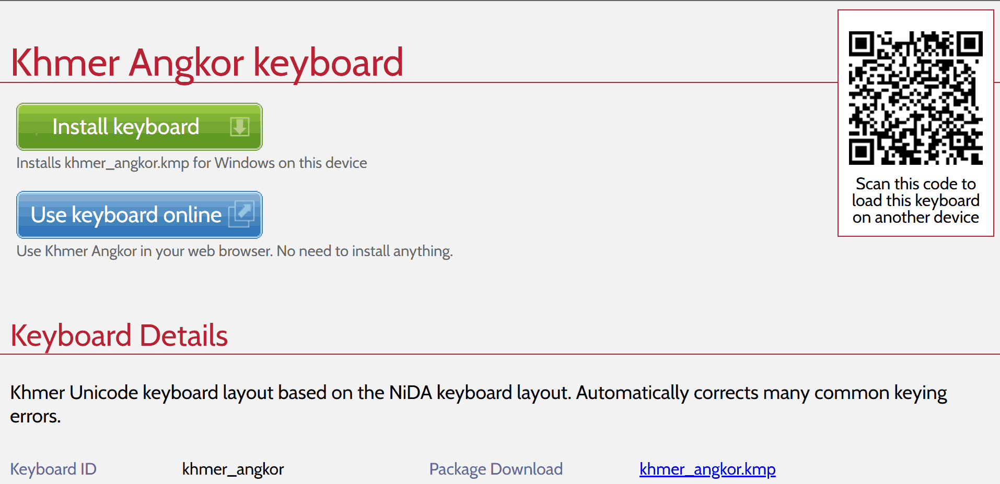
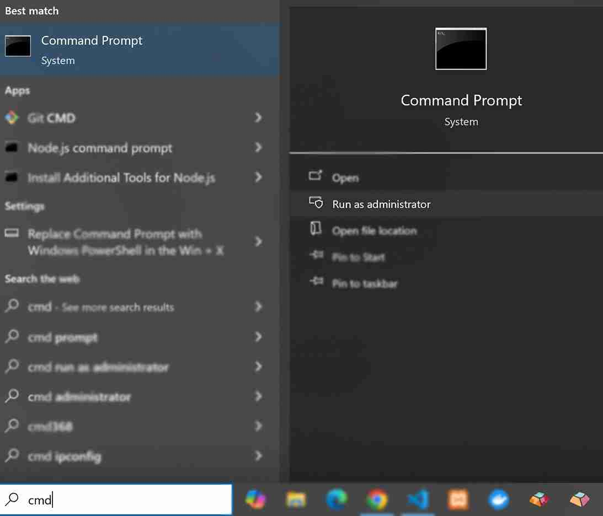

# HOWTO: Install a Keyman keyboard without a language on Keyman for Windows

This is a more in-depth guide to help install a Keyman keyboard onto Keyman for Windows without any language association using the Command Prompt, related to [transient LCIDs on Windows](/kb/116).

You should only follow the steps in this guide if you are having trouble installing
a keyboard through the normal methods, because you have run into the Windows 
limitation of 4 transient languages, as linked above.

### Install khmer_angkor.kmp

* Download the `.kmp` file for [Khmer Angkor keyboard](https://keyman.com/keyboards/khmer_angkor) (or other keyboard of your choice) from [keyman.com](https://keyman.com/keyboards/).

* The file should be available at the *Package Download* of the keyboard details page

    

* By default, the file should be in the download folder: `%userprofile%\Downloads`. But, can be specified to be in any other folder.

* Then, run the Command Prompt as Administrator.

    

### Install a Keyman keyboard without a language

* Once the Command Prompt is open, the path: `C:\Windows\system32>` might be what you see.

* If the `kmp` file is in the download folder, or already in a different folder. Please follow:

    ```cmd
    cd %userprofile%\Downloads
    ```

* Run this command:

    ```cmd
    "C:\program files (x86)\keyman\keyman desktop\kmshell.exe" -i khmer_angkor.kmp=
    ```

    > [!NOTE] The final `=` sign in the command above is important

    (This will install khmer_angkor.kmp for all users, but with no language association.)

### Result

* The keyboard will be visible in Keyman Configuration, but not available for use by a user until they choose a language to use it with.

    

* The users can add the language they wish to use by selecting **Add/remove language** in the Keyman Configuration dialog for that keyboard.

* The default language(s) for that keyboard will be shown in the **Add Language to Keyboard** dialog, but they can choose an alternative if they prefer:

    

* This should enable you to type the keyboard with the correct language.

## Applies to

* Keyman for Windows 