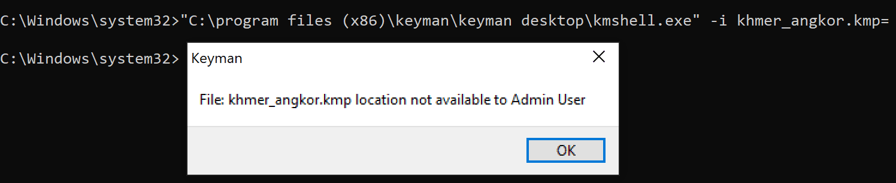

# HOWTO: Install a Keyman keyboard without a language on Keyman for Windows

This is a guide to help install a Keyman keyboard onto Keyman for Windows without any language association. It will be mostly useful if encountering the [transient LCIDs on Windows](/kb/116) issue.

## Installs with khmer_angkor.kmp

There are two methods to install, and both of them are practically the same until choosing where to place the `.kmp` file. To follow along, please prepare the `.kmp` file as follows:

* Get the `.kmp` file for [Khmer Angkor keyboard](https://keyman.com/keyboards/khmer_angkor) (or other keyboard of your choice) from [keyman.com](https://keyman.com/keyboards/).

* The file should be available at the *Package Download* of the keyboard details page

    

* Remember the location of the downloaded file, then Run the Command Prompt as Administrator.

* Continue to one of the method below.

### Method 1

In this method, we'll be working with the default directory of the Administrator: Command Prompt. For example: `C:\Windows\system32>`.

* Relocate the khmer_angkor.kmp file into the directory you see on the Command Prompt.

* Run the command (the final `=` sign is important):

    `"C:\program files (x86)\keyman\keyman desktop\kmshell.exe" -i khmer_angkor.kmp=` 

    (This will install khmer_angkor.kmp for all users, but with no language association.)

* Full Command:

```c
C:\Windows\system32>"C:\program files (x86)\keyman\keyman desktop\kmshell.exe" -i khmer_angkor.kmp=
```

### Method 2

Please follow this method if you see this error when running the command.     

: 

Without having to explain the technical information behind the error, let's focus on how to work around it.

* Use this command to go into a different directory, then create a folder as such:

```c
C:\Windows\system32>cd ../../

C:\>mkdir keyman

C:\>cd ./keyman

C:\keyman>

```

* Place the `.kmp` file into the keyman folder, then run the command (the final `=` sign is important).

    `"C:\program files (x86)\keyman\keyman desktop\kmshell.exe" -i khmer_angkor.kmp=`

    (This will install khmer_angkor.kmp for all users, but with no language association.)

* Full Command:

```c
C:\keyman>"C:\program files (x86)\keyman\keyman desktop\kmshell.exe" -i khmer_angkor.kmp=
```

### Result

* The keyboard will be visible in Keyman Configuration, but not available for use by a user until they choose a language to use it with.

    


* The users can add the language they wish to use by selecting **Add/remove language** in the Keyman Configuration dialog for that keyboard.

* The default language(s) for that keyboard will be shown in the **Add Language to Keyboard** dialog, but they can choose an alternative if they prefer:

    

* This should enable you to type the keyboard with the correct language.

## Applies to

* Keyman for Windows 