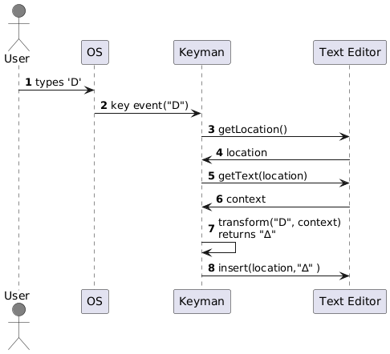

# Compliant and Non-compliant Applications in Windows, Mac and Linux

## Compliance

When using Keyman with a given Keyman keyboard, it should produce the same output regardless of what application is in use. For example, if using Microsoft Word, Apple Pages or Google Docs running in Google Chrome, the same keystrokes should produce the same characters. However, this is only possible if the application is fully **compliant**, meaning that the application fully implements all the APIs that Keyman needs to interact with it.

If an application is **non-compliant**, then Keyman attempts to work around any limitations, but typing cannot be supported in the same way as for compliant applications.

## Background

Typing with Keyman involves the interaction of three different software components:
1. **the operating system** (i.e. Windows, macOS or Linux) that generates the key event in response to the user's typing
1. **the application**, such as a text editor, that is active while the user is typing
1. **Keyman**, which transforms the key event into different characters according to the rules established by the active Keyman keyboard

For Keyman to do its job, it must receive key events from the operating system, but it must also have a means of communicating with the active application (via the operating system). There are three reasons that Keyman communicates with the current application:
* to learn the current location where the user is typing
* to read the text at a given location
* to insert or replace text at a given location

To be fully compliant, an application must respond accurately to these requests whenever the application is active.

## An example of a compliant application

The following sequence diagram illustrates what happens when the user types a key while Keyman is running.

**Note:** *This diagram is simplified as Keyman cannot communicate directly with the Text Editor application but only makes calls to APIs in the OS, which in turn communicate with the application.*

**step 1** The user types 'D'

**step 2**  The operating system notifies Keyman of the key event

**steps 3 to 6**  Before processing the key, Keyman gets the current location and reads the text at that location (this text is the context)

**step 7**  Using the key event, the context and the rules of the active Keyman keyboard, Keyman determines the appropriate output, "∆"

**step 8** Keyman inserts "∆" into the application at the current location

## The importance of context

If Keyman keyboards were limited to simply mapping one key to one character, context would not be important. For example, typing 'a' produces '&#x3b1;' and typing 'b' produces '&#x3b2;'.

However, many keyboards implement complex rules that depend on a sequence of multiple characters. With these rules, output of a key depends on the key typed and also the context, which is the text that immediately preceeds the insertion point.

For example, suppose that the user just typed the apostrophe in the following text:

>I always order the club sandwich at our corner caf'

If the active Keyman keyboard is `EuroLatin(SIL)`, and the user now types the letter **'e'**, Keyman will not simply output the character 'e'. Instead, it will see that the previous character typed was an apostrophe, and it will combine this with the 'e' and output an '&#x00e9;'. Keyman will insert this character in place of the existing apostrophe to produce the following text:

>I always order the club sandwich at our corner café

Without knowing the context, Keyman is unable to execute rules like this.

## Non-compliant behavior

The most common limitation with applications that are non-compliant is that Keyman is unable to read the context.

If the API to get the current location is not supported, then Keyman is not aware of where to read text to load the context.

If the API to get text is not supported, then Keyman may know the location but is still unable to read the text at that location.

Without knowing the context, Keyman would then produce this unacceptable text:

>I always order the club sandwich at our corner caf'e

## Working around non-compliant behavior

Applications that do not provide full support for the text input APIs can still be used with Keyman, though the experience is less predictable. 

### Inability to read context

Keyman works around the inability to read the context by keeping a small buffer of its recent output. Keyman can use the new key event combined with this buffer to determine the correct output.

The only problem with this approach is that it assumes that the user is typing continuously in the same application without taking any of these common actions:

- using the mouse to move the insertion point
- using a command key to move the insertion point
- using arrow keys to change the location
- pressing the home, end, page up or page down keys
- using a menu shortcut or hotkey to insert or remove text or move to a different location or document
- switching to another application

Keyman watches for all these context-changing events to detect whether its buffered context is still valid. If it detects one of these events, then it discards its buffer and assumes an empty context. This has the effect of Keyman appearing to forget where it was because it has no knowledge of its location in the document. If this happens in the middle of typing a sequence of keys, then the sequence will not be recognized and transformed properly and will need to be retyped.

### Inability to replace text

When the application does not correctly share the current location, then it is not possible to replace text because replacing text requires specifiying the location and length of characters to replace. Keyman works around this limitation by generating backspace keys and sending them to the application. 

In the earlier example with the apostrophe-e combination producing '&#x00e9;', only one character, the existing apostrophe, would need to be replaced. So Keyman would only need to send a single backspace. 

In other situations, the Keyman keyboard may both transform text and change the order of text that has already been typed. When that is the case, multiple backspaces would be generated as a workaround for non-compliant applications.
