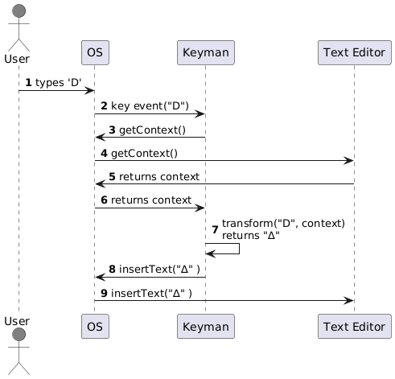
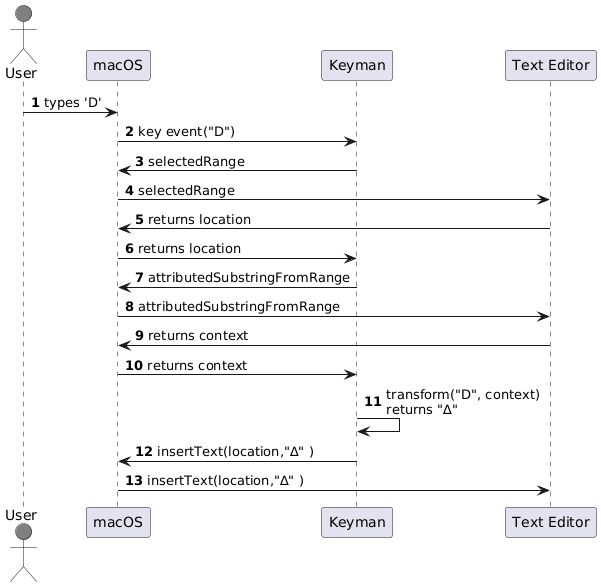
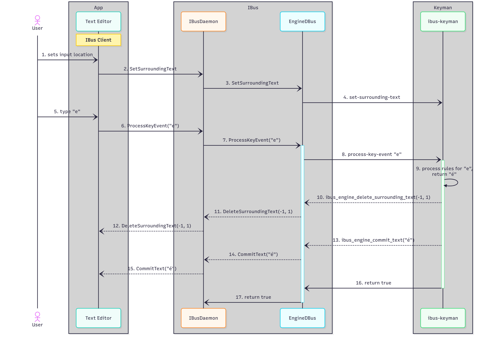

# Compliant and Non-compliant Applications in Windows, Mac and Linux

## Compliance

When using Keyman with a given Keyman keyboard, it should produce the same output regardless of what application is in use. For example, if using Microsoft Word, Apple Pages or Google Docs running in Google Chrome, the same keystrokes should produce the same characters. However, this is only possible if the application is fully **compliant**, meaning that the application fully implements all the APIs that Keyman needs to interact with it.

If an application is **non-compliant**, then Keyman attempts to work around any limitations, but typing cannot be supported in the same way as for compliant applications.

## Background

Typing with Keyman involves the interaction of three different software components:
1. **the operating system** (i.e. Windows, macOS or Linux) that generates the key event in response to the user's typing
1. **the application**, such as a text editor, that is active while the user is typing
1. **Keyman**, which transforms the key event into different characters according to the rules established by the active Keyman keyboard

For Keyman to do its job, it must receive key events from the operating system, but it must also have a means of communicating with the active application (via the operating system). Keyman communicates with the current application to:
* read the text at the current location
* insert or replace text

To be fully compliant, an application must respond accurately to these requests whenever the application is active.

## An example of a compliant application

The following sequence diagram illustrates what happens when the user types a key while Keyman is running.

**step 1** The user types 'D'

**step 2**  The operating system notifies Keyman of the key event

**steps 3 to 6**  Before processing the key, Keyman calls the OS to get the context (the text immediately preceeding the current location). The OS passes the request on to the application and then returns the result it receives to Keyman.

**step 7**  Using the key event, the context and the rules of the active Keyman keyboard, Keyman determines the appropriate output, "∆"

**step 8 and 9** Keyman calls the OS to insert "∆", and the OS calls the application to insert the text at the current location

## The importance of context

If Keyman keyboards were limited to simply mapping one key to one character, context would not be important. For example, typing 'a' produces '&#x3b1;' and typing 'b' produces '&#x3b2;'.

However, many keyboards implement complex rules that depend on a sequence of multiple characters. With these rules, output of a key depends on the key typed and also the context.

For example, suppose that the user just typed the apostrophe in the following text:

>I always order the club sandwich at our corner caf'

If the active Keyman keyboard is `EuroLatin(SIL)`, and the user now types the letter **'e'**, Keyman will not simply output the character 'e'. Instead, it will see that the previous character typed was an apostrophe, and it will combine this with the 'e' and output an '&#x00e9;'. Keyman will insert this character in place of the existing apostrophe to produce the following text:

>I always order the club sandwich at our corner café

Without knowing the context, Keyman is unable to execute rules like this.

## Non-compliant behavior

An application is considered non-compliant when it does not fully support the APIs that Keyman needs to communicate with it. Without compliant APIs Keyman may be unable to:
- get the current location where the user is typing
- get the current selection
- read the context
- insert text
- delete or replace text

## Working around non-compliant behavior

Applications that are not compliant can still be used with Keyman, and in many cases Keyman may function as expected. In some situations, Keyman's attempt to work around the limitations of a non-compliant application will result in inconsistent behavior.

### Inability to insert text

If the API to insert text into the application is not supported using an API, Keyman can work around this by generating individual key events to insert the text.
### Inability to replace text

 If the API to replace or delete text is not supported, then Keyman generates backspace key events which are consumed by the application.

This workaround can cause unexpected output when the application deletes more text than Keyman intended. If Keyman sends two backspaces to delete two codepoints, the application may delete an entire composed character consisting of two codepoints for the first backspace and then delete an additional character that should have remained untouched for the second backspace.

### Inability to read context

Keyman works around an application that is unable to read the context by keeping a small buffer of its recent output. Keyman can use the new key event combined with this buffer to determine the correct output.

The buffer maintained by Keyman will become stale if the user does anything to invalidate the context, such as:

- using the mouse to move the insertion point
- using a command key to move the insertion point
- using arrow keys to change the location
- pressing the home, end, page up or page down keys
- using a menu shortcut or hotkey to insert or remove text or move to a different location or document
- switching to another application

Keyman watches for all these context-changing events to determine whether its buffered context is still valid. If it detects one of these context-changing events, then it discards its buffer and assumes an empty context. This has the effect of Keyman appearing to forget where it was because it has no knowledge of its location in the document.

It is probably not a common occurrence, but if the context is invalidated while the user is in the middle of typing a sequence of keys, then Keyman will not recognize the sequence, and it will need to be retyped.

## Platform specifics

* [Compliance on the Mac](#compliance-on-the-mac)
* [Compliance on Linux](#compliance-on-linux)
* [Compliance on Windows](#compliance-on-windows)

## Compliance on the Mac

On macOS, there are three APIs that Keyman can call to support typing in the client application. These are as follows:

**`(NSRange) selectedRange`**

 This API returns a range that represents the location and length of the current selection. When no text is selected, it returns a length of zero.

**`(NSAttributedString *) attributedSubstringFromRange:(NSRange) range`**

This API returns the text found at the location and length of the specified range. The context is found by calling this API and passing the location returned from `selectedRange`.

**`insertText:(id) string replacementRange:(NSRange) replacementRange`**

This API inserts a string of text at the specified location, replacing the text over the specified length.

The following sequence diagram shows how these APIs are used when a user types a key.

**step 1** The user types 'D'

**step 2**  macOS notifies Keyman of the key event

**steps 3 to 6**  Before processing the key, Keyman calls macOS to get the current location, and macOS passes the request to the application

**steps 7 to 10**  Keyman calls macOS to get the context using the current location, and macOS passes the request on to the application and then returns the result it receives to Keyman.

**step 11**  Using the key event, the context and the rules of the active Keyman keyboard, Keyman determines the appropriate output, "∆"

**step 12 and 13** Keyman calls macOS to insert "∆" at the current location, and macOS passes the request to the application

### Non-compliance on the Mac

With macOS, setting the context and inserting or replacing text are dependent on knowing the current location. So if `selectedRange` does not return a valid location or length, then Keyman does not know where to read the context from or where to insert its output.

Non-compliant applications usually return zero or some other constant regardless of where the user is typing, and Keyman can detect this by checking the location returned before and after the first key event.

Other non-compliant applications may return the correct result for `selectedRange` but then return nil for `attributedSubstringFromRange`. This is also easy for Keyman to detect by checking a result after text has been inserted.

## Compliance on Linux

The default implementation of Keyman for Linux makes use of the input method (IM)
framework [IBus](https://github.com/ibus/ibus/) which adds another layer to the picture.
IBus is the default IM for Gnome. Other desktop environments may use other IMs
which Keyman does not directly support.

Compliant Gnome apps implement the [GTK IMContext API](https://docs.gtk.org/gtk4/class.IMContext.html).
Relevant for Keyman are the following API functions:

**`gboolean gtk_im_context_delete_surrounding(GtkIMContext* context, int offset,
int n_chars)`**

This method deletes characters around the cursor position. It corresponds to
the [`ibus_engine_delete_surrounding_text()`](https://ibus.github.io/docs/ibus-1.5/IBusEngine.html#ibus-engine-delete-surrounding-text)
IBus method.

**`gboolean gtk_im_context_get_surrounding_with_selection(GtkIMContext* context,
char** text, int* cursor_index, int* anchor_index)`**

This method, or the older `gtk_im_context_get_surrounding`, will return the
text and cursor position as well as a current selection. It corresponds to
the [`ibus_engine_get_surrounding_text()`](https://ibus.github.io/docs/ibus-1.5/IBusEngine.html#ibus-engine-get-surrounding-text)
IBus method.

**`void gtk_im_context_set_surrounding_with_selection(GtkIMContext* context,
const char* text, int len, int cursor_index, int anchor_index)`**

This method, or the older `gtk_im_context_set_surrounding`, will set the
context, the cursor position and the selection. It corresponds to the
[`set-surrounding-text`](https://ibus.github.io/docs/ibus-1.5/IBusEngine.html#IBusEngine-set-surrounding-text)
signal in IBus.

IBus will set a flag in `IBusEngine.client_capabilities` if the client
application supports surrounding text.

The following sequence diagram shows how these APIs are used when a user types a key. The text editor already contains
the text "I always order the club sandwich at our corner caf’". The user just switched back to the text editor.

**Step 1** The user types sets the input location by clicking behind the apostrophe in the text editor

**Step 2** The IBus client which is hooked up to the text editor sends a `SetSurroundingText` signal to the IBus daemon

**Step 3** The IBus daemon sends a `SetSurroundingText` signal to the IBus engine

**Step 4** The IBus engine sends the  `set-surrounding-text` signal which Keyman receives. It sets its internal context to
  the received text.

**Step 5** The user types the letter 'e'

**Step 6/7** The IBus client sends the `ProcessKeyEvent` signal to the IBus daemon which in turn sends it to the IBus engine

**Step 8** The IBus engine sends the `process-key-event` signal to Keyman

**Step 9** Keyman processes the keyboard rules.

**Step 10** As a result, Keyman calls the `ibus_engine_delete_surrounding_text()` method to delete one character to the
  left of the cursor.

**Step 11/12** The IBus engine calls the `DeleteSurroundingText` DBus method to the IBus daemon which in turn calls it on
  the IBus client

**Step 13/14/15** Keyman calls the `ibus_engine_commit_text()` method to insert the character 'é' at the current location.
  This makes it's way as `CommitText` eventually to the IBus client.

**Step 16** Keyman returns `true` as result to the `process-key-event` signal handling to indicate that the key event was
  processed.

**Step 17** The IBus engine returns from `ProcessKeyEvent` with a `true` result. Since no further processing is required,
  the sequence ends here.

### Non-compliance on Linux

For non-compliant applications, Keyman can not get the context. The only way is to keep a record of the output characters.
This only works while typing, but not when switching applications or moving the insertion point.

IBus is able to tell whether or not the application supports surrounding text. If it does not, i.e. it's a non-compliant
application, Keyman has to simulate a backspace key event to delete the last character. Since the events are asynchronous,
there's no guarantee that the backspace event will be processed before the next key event. Keyman therefore calls a method
on the Keyman system service which emits a fake key event. That way it is possible to force the correct order of the output.

## Compliance on Windows

TODO