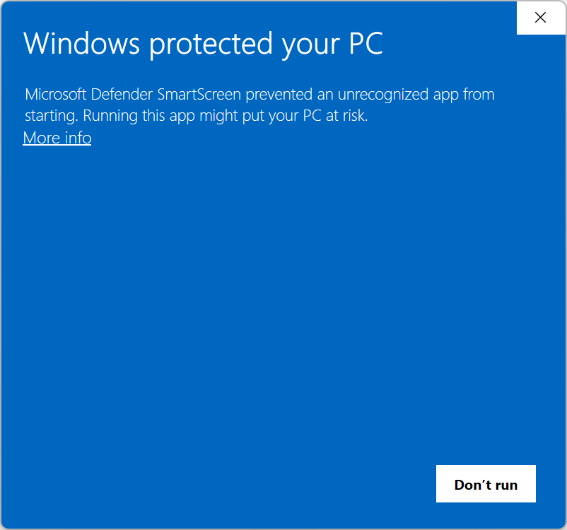
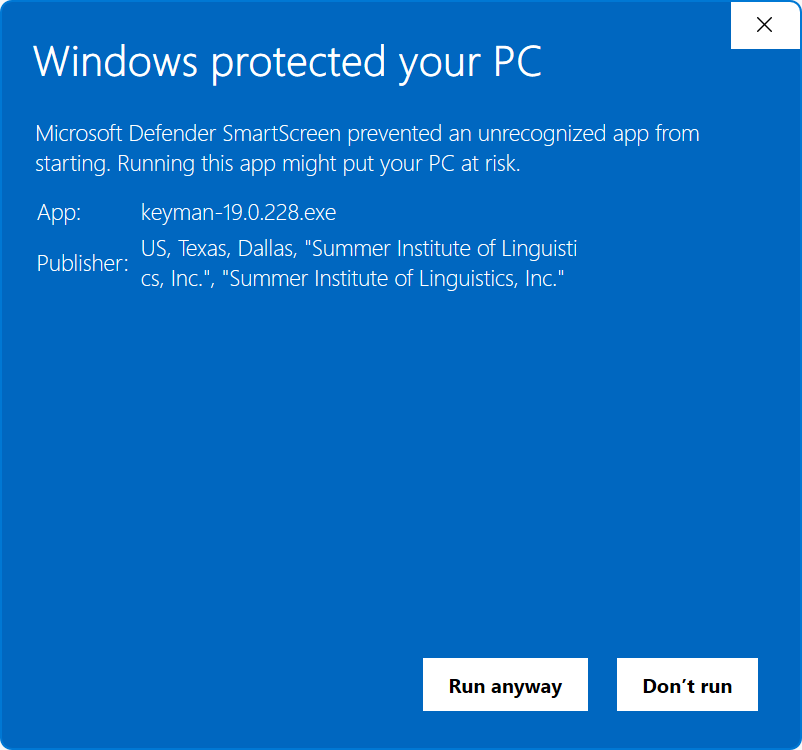

# Microsoft Defender SmartScreen

## Summary
Due to changes in how certificate signing and trusted applications are handled, you *may* see the following SmartScreen notification when installing Keyman.

 

## Installation

To continue installation, click **More info**. This will display the name of the Keyman installation file and the publisher name, Summer Institute of Linguistic (SIL) from the signing certificate.
It also adds a **Run anyway** button which will enable you to continue installation.

**What has changed**

Previously, applications signed by Azure Artifact Signing (formerly Trusted Signing) meant that there was no SmartScreen prompts during installation. Microsoft Defender SmartScreen now relies also on application reputation, which is built over time based on factors determined by Microsoft.

As a result, SmartScreen prompts may appear until the Keyman installer establishes sufficient reputation.

## Applies to

* Keyman for Windows
* Keyman Developer
 