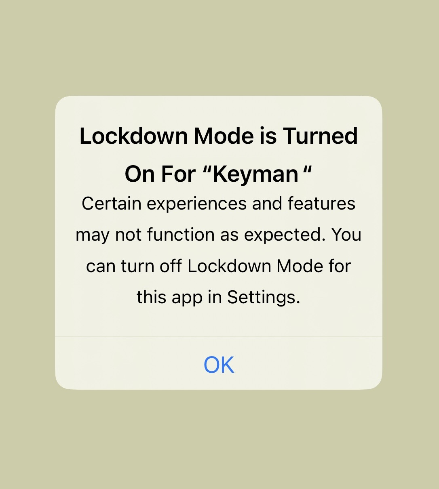

# iOS Lockdown mode inteferring with Keyman for iPhone and iPad

The Lockdown mode is a feature in Settings -> Privacy & Security -> Lockdown Mode (or simply search Lockdown in Settings). This feature stops Keyman from functioning normally, even if "Allow full access" is enabled.

## Symptoms

Launching the Keyman app when the Lockdown mode is freshly enabled will **sometimes** show an alert stating Lockdown mode is Turned On For "Keyman".

The symptoms seem to appear while trying to switch to Keyman when typing outside the Keyman application, where the keyboard switches to the systematic English keyboard.

<video width="640" height="360" controls>
  <source src="./assets/kb0122/lockdown_mode_switch_to_keyman.mp4" type="video/mp4">
</video>

## See also
* [Allow full access on iPhone and iPad](../products/iphone-and-ipad/current-version/start/installing-system-keyboard#toc-on-allow-full-access-)

* Visit [Apple's Lockdown Mode](https://support.apple.com/en-us/105120) article

## Applies to

* iOS 16 or later
* iPadOS 16 or later
* Keyman for iPhone and iPad