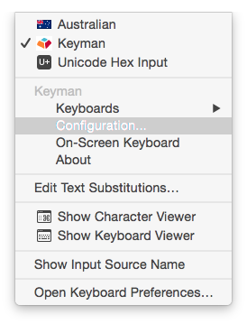
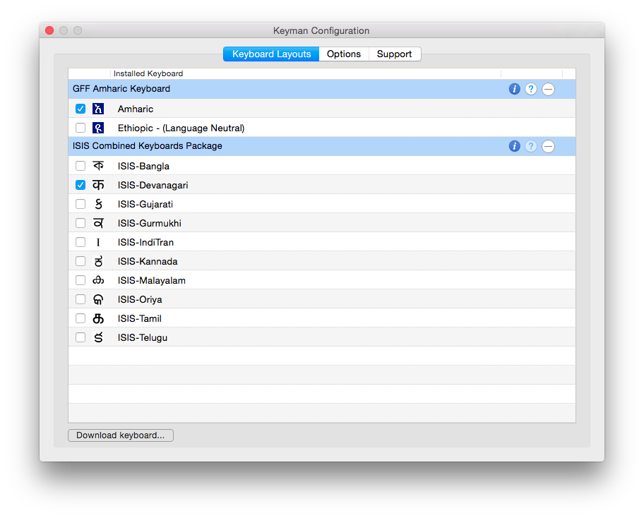

The Configuration window allows you to change several things about the way
Keyman works, as well as access information about installed keyboards. To
display the Configuration window, do the following:

1. 

   Make sure that Keyman for macOS is the active input source (as shown above).
   For more information, see [Getting Started with Keyman for macOS](../start/tutorial).
2. Click the Keyman icon to display the Input menu.
3. On the Input menu, in the section for Keyman, click **Configuration**. Note: If you just
   installed Keyman and the Configuration menu is not available, please restart the computer.
   

4. The Keyman Configuration window appears:
   

Following are instructions for performing various tasks in the Configuration window:

## Enable and Disable a Keyboard

Keyman keyboards can be enabled and disabled. Disabling a Keyman keyboard removes
it from the Keyman menu and Keyman Toolbox but does not uninstall the keyboard.
This is useful if:

* You are using a single keyboard layout from a package with multiple
  keyboards and you want to remove the extra keyboards from the Keyman
  Toolbox and menu.

* You have a keyboard layout installed which you aren't currently using but don't
  want to uninstall.

To disable a Keyman keyboard, untick the corresponding checkbox. To enable a
disabled keyboard, tick the checkbox.

## Remove Keyboards

Removing a Keyman keyboard package uninstalls and deletes the entire
package. Although you can disable individual keyboards (as described above),
if an installed package contains more than one keyboard, you cannot remove
them individually.

To remove a keyboard package, click the delete button
 in the far right of the row with the
package name.

## Display Keyboard Information

All Keyman keyboard packages contain some basic metadata information,
such as the name and version, included fonts, author, and copyright. To
display this information, click the information button
 to the right of the package name.

## Display Keyboard Help

Many Keyman keyboard packages contain help files, with instructions for
learning to use the keyboard(s) to type special characters. This is
especially helpful for keyboards that use multiple key sequences to
generate characters, since it is not usually possible to convey this
information via an on-screen keyboard showing the individual characters
associated with the keys on the physical keyboard. To open a window that
will allow you to view the keyboard help, click the help button
 to the right of the package name. (If
this button is disabled, it means that no help files were included in the
package.)

## Keyman Configuration Options

If you select the **Options** tab on the Keyman Configuration window, you
will see that there are two configuration options that affect the general
behavior of Keyman, regardless of which keyboard is active:

* **Always show on-screen keyboard**: If this option is ticked, the
  on-screen keyboard will be displayed automatically whenever Keyman
  becomes the active input source.

* **Use verbose Console logging**: If this option is ticked, advanced
  troubleshooting information will be sent to the system log. If the
  Keyman development team is assisting you to resolve a problem, they
  might instruct you to enable this option so you can supply them with a
  log of important debugging messages from Keyman. You can view this log
  information yourself using the Console utility, by filtering to show
  only messages from the Keyman process (although it probably won't be
  very meaningful to you unless you are a computer programmer and you are
  looking at the Keyman for macOS source code). Console is a log viewer
  developed by Apple Inc. and included with macOS.

## Keyman Configuration Support

The **Support** tab on the Keyman Configuration window displays the same
program help information available on-line at
<a href="https://help.keyman.com/products/mac/">help.keyman.com/products/mac</a>
