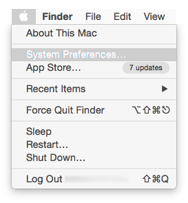
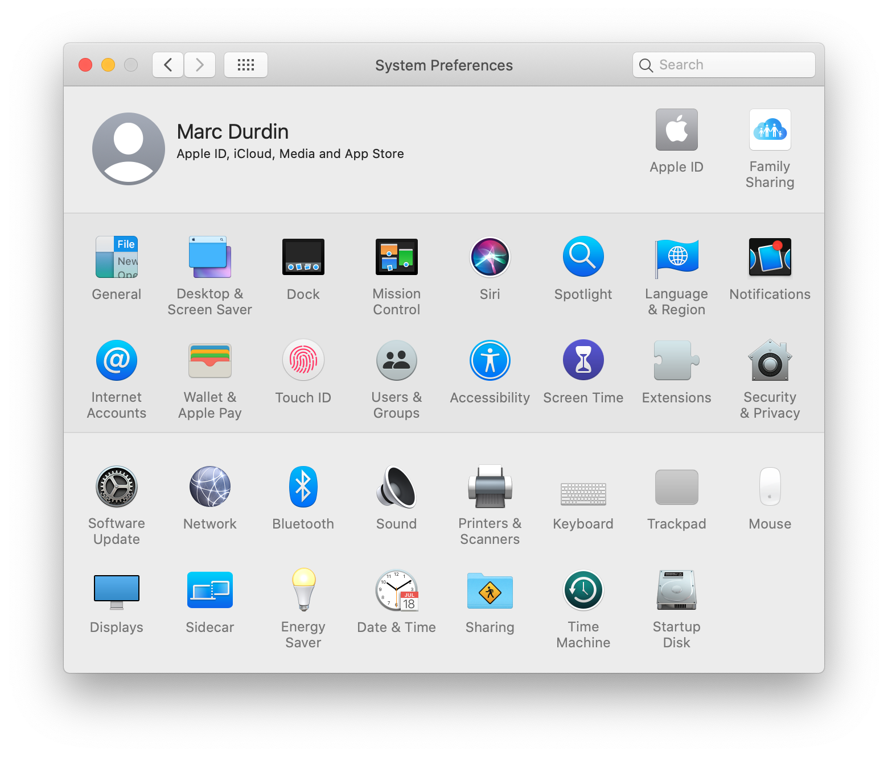
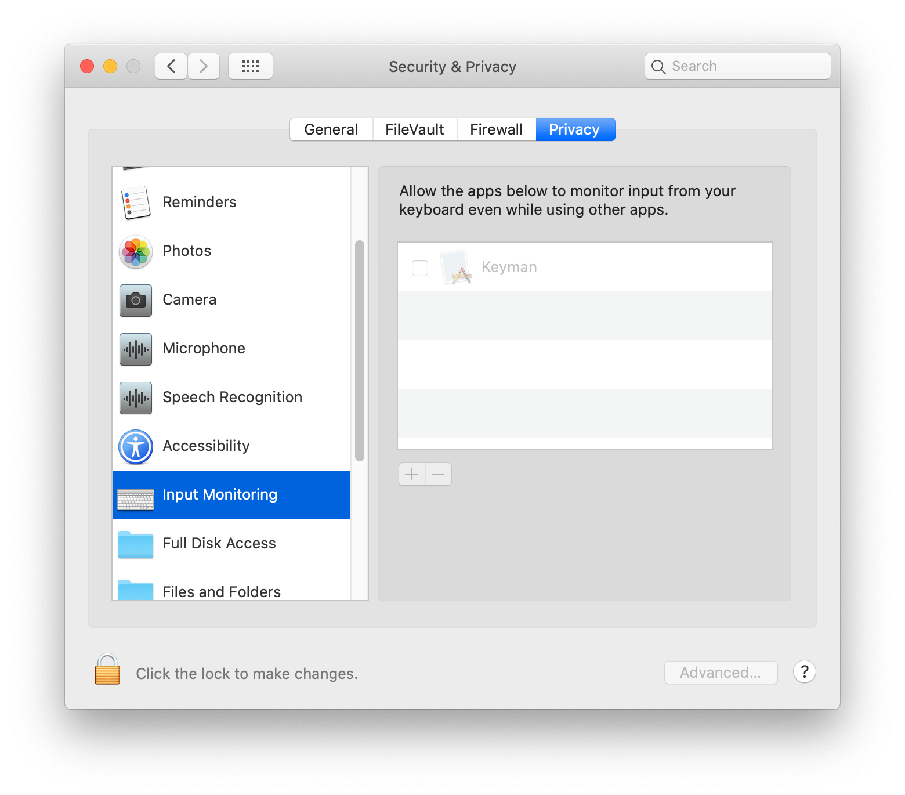
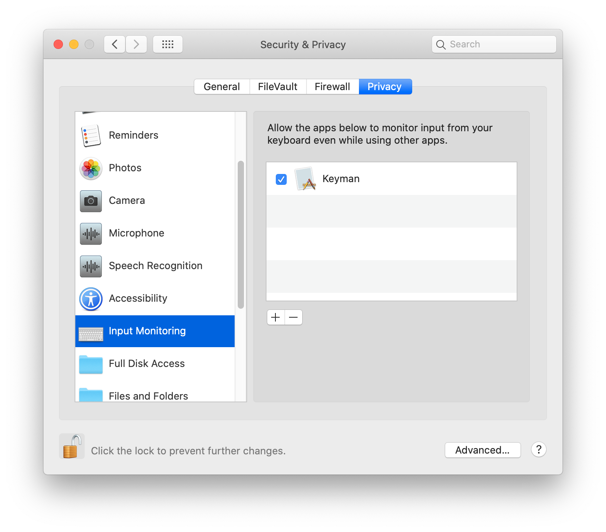
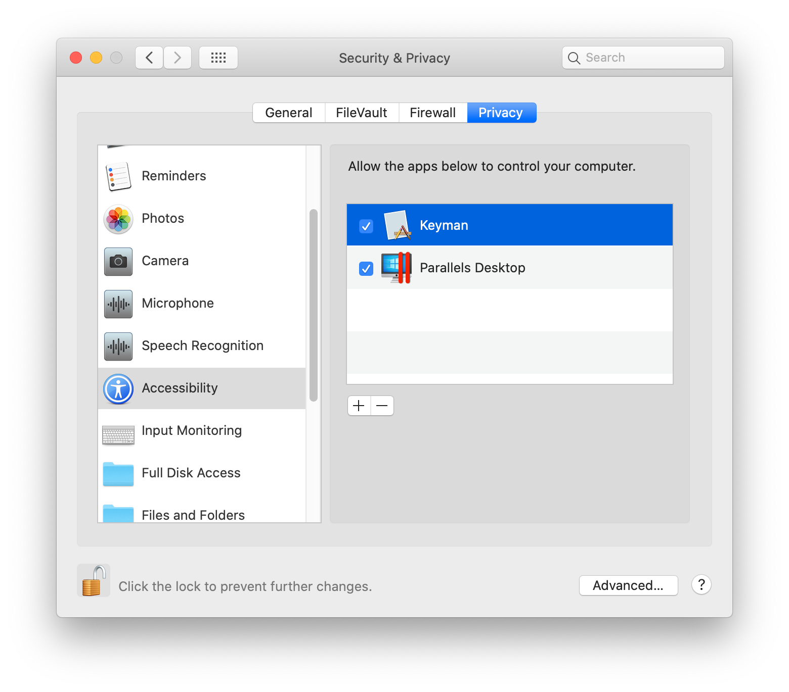

Keyman requires access to your keyboard in order to translate input. In macOS Catalina, there
are two different Privacy settings you will need to configure in order for Keyman to work
correctly:

* Privacy / Input Monitoring
* Privacy / Accessibility

**Note:** Keyman may not appear under these settings until it has been run at least one
time. If Keyman does not appear in the relevant panes in System Preferences, select Keyman
from the Input Sources menu and try typing in an app.

## Enabling Keyman

1. Open **System Preferences**:

   

2. Select **Security & Privacy**, and choose the **Privacy** tab:

   

3. Select **Input Monitoring**. Keyman should appear in the list.

   

4. Unlock the settings with the lock icon, then check the Keyman item:

   

5. Select **Accessibility**, and ensure that Keyman is checked there as well:

   

**Note:** You may be prompted to shut down Keyman. If so, follow the prompts to shut down
Keyman. You'll need to select an alternate input source from the Input Sources, and then
switch back to Keyman, to start using Keyman again.

You should only have to undertake this procedure once. However, if you upgrade your version of macOS,
and Keyman stops working, follow these steps to re-enable Keyman.
